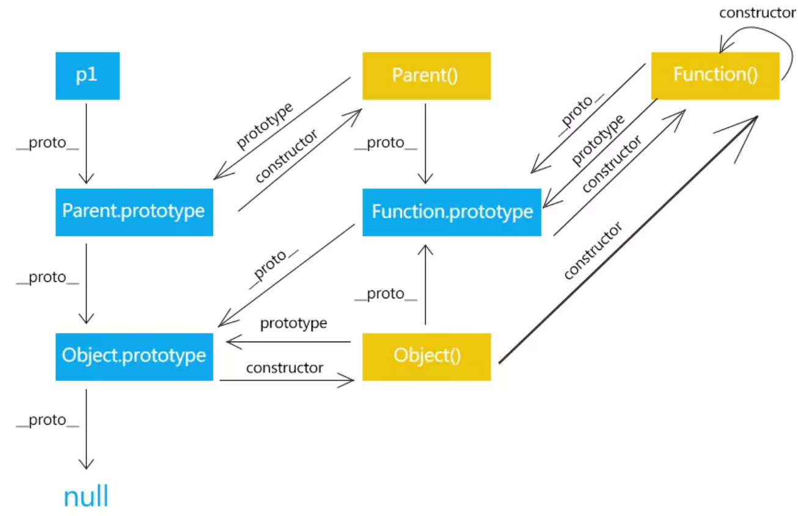

# 原型与原型链

单独将原型与原型链有点太突兀，所以我们由浅入深，先谈谈掌握原型链的前置知识。    

## 如何创建一个对象

es5 以及之前的版本并没有支持面向的解构，因此 es5 有自己的创建对象以及继承的方法。     

### 工厂模式    

简单来说，工厂模式就是一个函数，给它不同参数，就返回不同的对象。    

用工厂模式创建对象如下：    

```js
function createPerson(name, age, work) {
    let o = new Object(); // 创建一个空对象
    o.name = name;        // 添加属性
    o.age = age;
    o.work = work;
    
    //添加方法
    o.sayName = function() {
        console.log(this.name);
    };
    
    // 返回对象
    return o;
}
let p1 = createPerson('sofia', 19, 'engineer');
p1.sayName();   // sofia
```

工厂模式的问题是，所有对象都是从 Object 类型，你无法知道该对象是什么对象，也无法区分。    

仅做了解即可。    

---
### 构造函数模式

这才是我们第一个重头戏。    

构造函数很重要!    

构造函数很重要！    

构造函数很重要！    

重要的事情说三遍。    

好了，不水字数了，先来谈谈什么是 构造函数，以及它和普通函数有何不同。    

**构造函数与普通函数唯一的区别就是调用方式的不同( new 调用 )，除此之外，构造函数也就是函数**     

我们来重写上述的工厂函数：    

```js
function Person(name, age, work) {
    this.name = name;
    this.age = age;
    this.work = work;
    this.sayName = function() {
        console.log(this.name);
    }
}
let p1 = new Person('sofia',19, 'engineer');
let p2 = new Person('7',15,'killer');
p2.sayName();  // 7
p1.sayName();  // sofia
``` 
我们来比较其与工厂函数有何不同：    

1. 没有显示创建对象 ( new Object() ).    

2. 属性和方法直接赋值给了 this 。    

3. 没有 return。    

且每个实例都有一个 constructor 属性指向其构造函数。    

带来的好处是每个对象都有标识了。    

来看下面代码    

```js
console.log(p1 instanceof Person)  // true
console.log(p1 instanceof Object)  // true
console.log(Person instanceof Object)  // true
console.log(Person instanceof Function) //true
console.log(Function instanceof Object) //true
```

instanceof 操作符我们后面在讲，这里的意思可以理解为 ：    

前面的对象是基于后面的构造函数创建的吗？    

这样，我们创建的对象就可以区分类别了。但同时也带来了问题。    

没当我们创建对象时，还为其方法分配了空间。    

```js
console.log(p1.sayName === p2.sayName);  // false
```

实际上，方法大家是可以共用的，调用时 this 的指向会自动装到调用它的对象。    

所以，我们引出了原型的概念。

---

### 原型模式

这里将分一大节来谈原型。    

## 原型和原型链

首先，我们需要知道的是：    

1. 每个函数都会有一个 prototype 属性，指向一个对象 (即我们的原型)。    

2. 在改对象上定义的属性和方法，可以被所有该构造函数创建的对象访问。    

3. 原型会有一个 constructor 属性指回其构造函数。    

4. 构造函数所创建的实例上，有一个指针指向构造函数的原型    

firefox,safari,chrome 将这个指针称为 __proto__ ,后面我们都用， __proto__ 代替该属性。    

5. 最后是原型可以链式传递。    

6. 实例找属性和方法，先在自己身上找，找不到就沿着原型链一层一层向上爬。    

因此，可以想到的是，constructor 属性，它会在实例的原型上找到，就好像实例也有这个属性，但不是的。    

你可以用 hasOwnProperty 来验证。

这样 p1.constructor ==  Person.prototype.constructor == Person.    


讲了这么多，可能有点糊，我们还是看图吧：    

;    

看图后，就比较好理解了，但是想提一点是 Function.prototype。    

Function.prototype 上定义了很多有用的函数：    

1. bind    

2. call    

3. apply    

4. toString(): 获取函数源码的字符串，实际是重写 Object.prototype 上的方法。    

还有一点是， Function.prototye == Function.__proto__    

先这样理解，因为所有的函数都可以认为是 new Function 得到的。所以Function.__proto__ == Function.prototype    

Function.prototye.__proto__ == Object.prototype    

这样函数就又从 Object 的原型上继承了属性。    

至于 Object.prototype 它是最顶层的原型了，且 Object.prototype == null    

这里就先探讨到这吧，因为这里有坑，还是很大的坑，看了两个小时，自己没搞明白，还给带进去了。    

有一篇文章讲的挺好，['function.prototype 为什么是函数']()    

我们继续谈其他的知识，此中问题有时间深究。    


