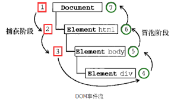

# 事件代理

## DOM 事件流    

要说事件代理，还是得先谈一谈 DOM 的事件流。    

首先，DOM2 Events 规范规定了事件流分为 3 个阶段：    

1. 事件捕获：最先发发生，为提前拦截事件提供可能。    

2. 到达目标: 实际的目标收到事件    

3. 冒泡阶段（bubbles）：最迟要在该阶段响应事件。    

所以，我们有两次机会可以处理事件，不过我们的事件委托一般是在冒泡阶段处理的。    

（捕获阶段也可以，但低版本浏览器支持不好）        

还没理解就看图吧：    

    

## 事件委托

好了有了这些前置知识，我们再来谈事件代理。    

事件代理出现的场景是，有很多元素的事件要监听，若给每个元素都增加事件处理函数。会有一下缺点。    

1. 可能很多元素处理的事件方法是相似的，若按上述做，会有冗余代码。    

2. DOM 操作是非常昂贵的，而事件处理程序越多，访问 dom 的频率就会越多，影响性能。    

所以我们要在其父元素增加事件处理程序。     

由于冒泡的存在，这些事件总会冒泡到父元素的，我们只需在冒泡的时候带上参数就行了。    

---

下面来实现一个小的事件代理的例子    

```html
<body>
    <h1>事件代理</h1>
    <ul id='parent'>
        <li>苹果</li>
        <li>梨子</li>
        <li>香蕉</li>
    </ul>
</body>
<script>
    let parent = document.getElementById('parent')
    parent.addEventListener('click',(event) => {
        let target = event.target;
        alert(target.innerHTML);
    })
</script>
```

例子其实很简单，我们在 li 的父元素 ul 上定义了时间处理程序。    

每当 li 被点击时，事件冒泡给 ul ，它处理事件，弹出被点击元素的文本内容。    

---

但是，不是所有的事件都支持冒泡的。接下来我们还是继续深入 DOM 事件流的原理。    

## DOM 事件流补充


