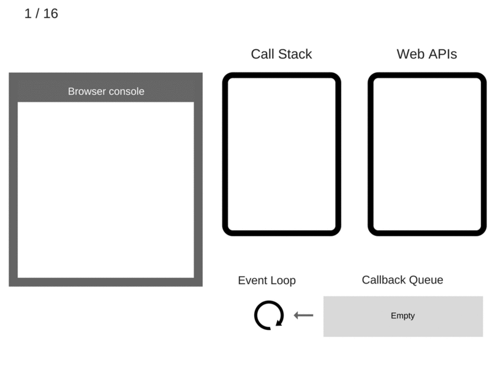

# event loop

首先，event loop 是 js 运行代码的一个机制。    

先来看 js engine 是如何运行 js 代码的。    

    

来解释一下，    

1. Call Stack: 是一个运行 js 代码的栈，所有主线程代码都得通过压栈到 Call Stack 里去执行。    

2. Web APIS: 他们是浏览器的其他线程，可以和主线程并行，比如计时，网络请求。我们只能调用它们，无法访问它们，它们是 C++ 写的（ v8 engine 是 c++ 写的）    

3. Memory Heap: 这个很好理解，存放引用类型的堆。    

4. Callback Queue: 当 stack 为空时，就会把 queue 里面的任务压进 stack 执行。    

再来看一段代码的执行过程：    

```js
console.log('Hi');
setTimeout(() => {
    console.log('cb1');
}, 5000);
console.log('Bye');
```    

    

---

当 es6 出现的时候，出现了一个新的队列，**Job Queue**。    

它是干什么的呢？它是存放 **Micro Task** 的，job queue 的任务优先于 callback queue 中的任务。    

微任务一般是 promise 的任务。    

也就是说，当 stack 为空时，我们先是看 **Job Queue** 中有无任务，有的话，就先把这里的任务压栈，其次才去找**Callback Queue**。    


job queue 和 callback queue 区别：    

1. 当执行来自 callback queue 中的任务时，在每一次新的事件循环开始迭代的时候，运行时都会执行 callback queue 中的每个任务，在每次迭代开始后加入到 callback queue 的任务要在下一次迭代开始的时候才会执行。    

2. 每当一次任务退出，且执行上下文为空时，job queue 中的每一个 micro task 都会依次被执行，直到 job queue为空。    

换句话说，即使其中又加入了新的 micro task，也会在本轮执行完。    

---

来看例子吧：    

```js
async function async1() {
  console.log('async1 start');
  await async2();
  console.log('async1 end');
}
async function async2() {
  console.log('async2');
}
console.log('script start');
setTimeout(function() {
  console.log('setTimeout');
}, 0);
async1();
new Promise(function(resolve) {
  console.log('promise1');
  resolve();
}).then(function() {
  console.log('promise2');
});
console.log('script end');
```

输出的结果就不写了，看的时候自己分析。    


参考：    

https://flaviocopes.com/javascript-event-loop/    
https://blog.sessionstack.com/how-javascript-works-event-loop-and-the-rise-of-async-programming-5-ways-to-better-coding-with-2f077c4438b5