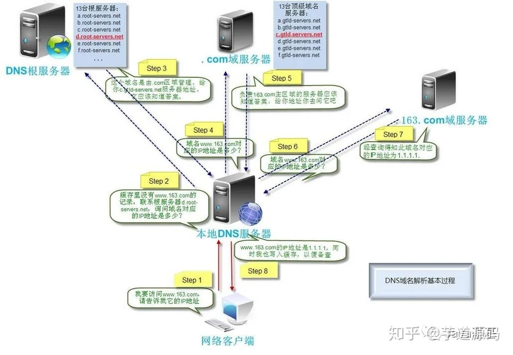
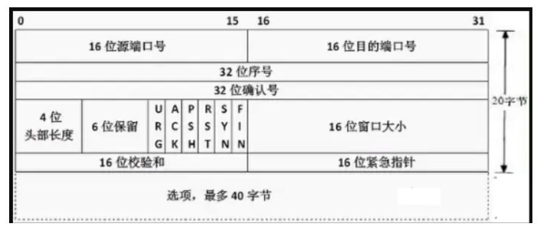
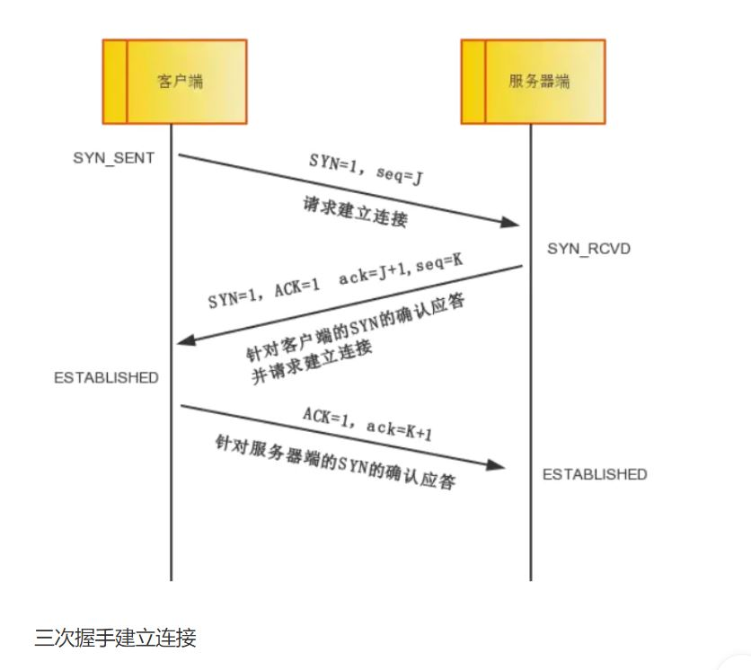

# 输入 url 到生成页面过程

## url 的构成
先来了解 url     

url：uniform resource locator  (统一资源定位符)。    

其作用是来定位网上的资源。 

这里还是想讲一下，uri 和 url 的区别。    

uri ： uniform resource identitifier  (统一资源标识符)    

就是用来唯一标识网上的一个资源。    

在回到 url 它是唯一定位网上的资源的，也就是说，给了 url 就能确定某个资源。(不正是 uri 的作用吗？)    

所以，url 是 uri 的一种实现方式，也可以说，url 是 uri 的子集。     

---

好了，由于我们用基本都用 url 来实现 uri 所以就只谈 url ，碰到 uri 其实也可以用 url 代替。以便理解。    

来看一个 url ：    

**scheme://host.domain:port/path/filename**    

一一解释各个部分表示意思。    

- scheme: 协议，常见的协议有，http， https，ftp，file。    

- host：定义域主机，http 默认的是 www 。    

- domain：域名，用于定位计算机地址,一般就是服务器地址。    

- port：端口号，计算机上有很多端口号，服务器监听不同端口号，做不同的事。    

- path：定义服务上的路径。    

- file：服务器上的文件资源。    

好了，现在我们输入了这个 url 来看浏览器接下来干什么。    

---

## DNS 域名解析

IP 地址：    

IP 地址是用来唯一标识一个计算机的二进制数。    

ipv4 采用的是 32 位，但随着互联网的发展，发现 2 的 32 次方减 1 个 ip不够用了。    

于是出现了 ipv6，它用 128 位来表示 ip 地址，从而解决了 ip 不够用的问题。    

---

计算机的 ip 地址是一串数字，而域名是一串字符串(为了方便人记忆)。    

所以，我们首先要把字符串的域名解析为 ip 地址才能找到要请求交流的计算机。    

而这，就是我们的 DNS 的工作了。    

DNS 和 HTTP 一样，是应用层的协议。    

但这里的 DNS 我们可以理解为一个服务器，url 先发给 DNS 服务器，它返回一个 ip 。    
    

    

至于 DNS 的查找过程，下面图可以清晰解释。     

    

这样，就得到 ip 地址了，最后把其他信息和 ip 地址一起发到公网上，找服务器。    

经过路由一站一站的中转，我们找到了要访问的计算机，接下来就是和它建立连接了。     

## TCP 三次握手

首先，还是先了解一下 TCP 。    

TCP 位于 TCP/IP 协议中的传输层，上层就是应用层(http,https), 下层是网络层(ip)。    

1. 先是网络层的 IP 找到要连接的计算机，    

2. 传输层的 TCP 建立连接，    

3. 应用层的 HTTP 才能互相发送数据。    

TCP 从网络层那里接受到数据包，此时的数据包包含了 **传输的数据** 和 **TCP 首部**。    

数据就是应用层我们要传输的数据，这里来看如何用 TCP 首部建立连接。    

tcp 首部：    

     

来分析一下首部包含的信息    

- TCP 端口号    
    TCP 的连接需要四个要素的确定唯一的一个连接。    
    （源IP,源端口号） + （目的IP,目的端口号）
    所以 tcp 首部预留了两个 16 位作为端口号的存储，也就是说，端口号的范围是 1^16 = 65535,1024 以下是系统保留的。    

- TCP 的序号和确认号    
    * 32 位序号 seq ：通过这个来确认发送数据包的有序。    
    * 32 位确认号 ack ：tcp 对上一次 seq 的序号做出的序列号，用来响应 tcp 报文，给收到的 tcp 报文段的序号 seq 加 1。    

- TCP 的标志位：    
    这里仅讲最常用的：    
    * SYN: async, 同步标志位，用于建立会话连接。    
    * ACK: acknowledge, 确认标记位，对已接受的数据包进行确认。    
    * FIN: finsih， 完成标记位，表示已经没有数据要发送了， 即将关闭连接。    

---

okk， 了解了这些前置知识，我们再来看三次握手。    

直接看图吧： 

    

* 第一次握手：    
    客户端将 TCP 报文 SYN 标志位设为 1 ，表明请求建立连接    
    随机生成一个序列号值 seq = j，指明连哪个端口。   
    然后首部发送给服务器    

* 第二次握手：    
    服务器收到 SYN = 1 后，知道客户端请求连接，所以设置：        
    ACK = 1,表明收到了请求。    
    SYN = 1,表明情求连接客户端。    
    ack = J + 1,    
    随机生成一个 seq = K.    
    然后将首部发给客户端。    

* 第三次握手：    
    客户端收到数据包后，检查 ack 是否为 J+1，如果正确就将标志位 ACK 设为 1 ，ack = K + 1,发送给服务器。    
    服务器端检查 ack 是否为 K + 1, ACK 是否为 1 ，如果是，说明连接成功了，可以互发数据了。    

为什么 TCP 要握手三次呢？    

目的是避免通信过程的错误，比如失效了的连接请求突然又发送传送到了服务端，而客户端可能因为网络不好，早就下线不在了，从而引起错误。    

这和人们打电话很相似。   

:::tip
三次握手：    
‘喂，你听得到吗？’    
‘我听的到，你听得到我说话吗？’    
‘嗯，我听的到你说话’
:::

经过这三次确认，两人才能确认电话是好的，才能继续说话。     

好了，经过漫长的握手，建立连接，接下来就是应用层的 HTTP 的事情了。    

---   

## 发送 HTTP 请求

