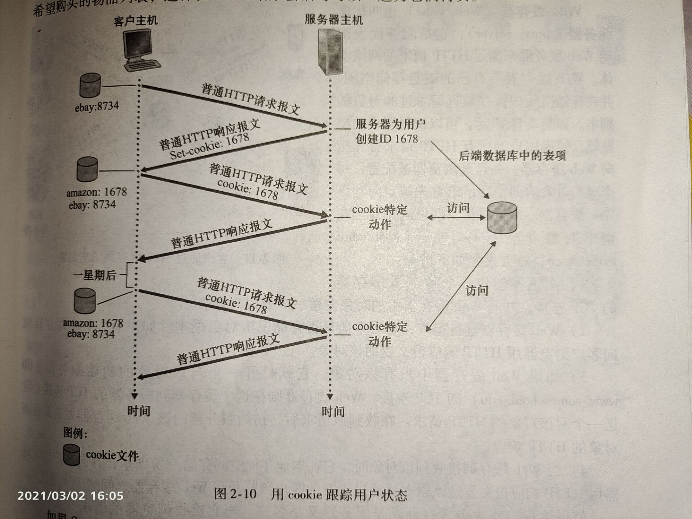

# cookie 最初作用

首先提一点是 ，cookie 本意不是用来作为 本地存储的，虽然之前很多都借用了cookie 来实现本地存储。     

好在，现在已经有了 localstorage， sessionstorage，去实现了本地的存储，所以，cookie 也回归了自己本来作用。    

cookie 字段以及值，我们在 http 头部，以及 web 前端基础中也已经讲过了，这里也不谈。    

---
---

cookie 的实现有 4 个技术。    

- 在 HTTP 的请求报文中有一个 cookie 行。    

- 在 HTTP 的响应报文中有一个 cookie 行。    

- 在客户端系统中保留一个 cookie 文件，并由用户浏览器进行管理。    

- 位于 Web 后端的数据库中，有存放 cookie 的表，我们一般也叫 session    

了解了上面，我们再来看一个小故事，看看 cookie 在干嘛。     

假设 susan 总是在家用 pc 上网，之前它访问过了 ebay 站点，现在她去访问 Amazon.com，这是她首次与 Amazon 服务器取得联系。    

当她的请求报文到达 Amazon 服务器时，该站点就生成一个唯一的标识码，并把该标识码存入数据库，再响应的时候，响应报文首部加上     

Set-Cookie: susan = 1678    

于是当响应报文到达 Susan 的浏览器时，浏览器就在 cookie 文件中加上一行，该行包含了 服务器主机名，以及接受到的 cookie。     

回看一下，之前 susan 不是也访问过 ebay 吗？ 所以 cookie 文件中也会有 ebay 的一行信息。    

当 susan 继续浏览 Amazon 网站时，每发送一个请求，浏览器就会查询 cookie 文件，找到那行 cookie 信息，放到请求头部，一并发出。    

于是，Amazon 服务器在接受请求的时候，会看到这行 cookie 信息，它就知道了，哦，是 1678 来访问我啦。    

包括之前 susan 什么时间访问访问了什么就都会知道，于是，Amazon 就贼一点，用这些信息，推荐商品给 susan。    

这对 susan 有什么好处呢？ 如果 Susan 在 Amazon 注册过，那 Amazon 就会把这次带 cookie 的访问和susan 的信息结合起来，    

在付款的时候，包括填地址，填电话都不用填了，因为数据库上有啊，(貌似还是 Susan 吃亏)。    

来看图吧，虽然很糊；    

     

通过上面这个小故事，想必你大概对 cookie 有了一定理解了。    

当然，cookie 的存在，会有信息泄露的风险。    

这点暂时不谈，因为，现在还存在争议。