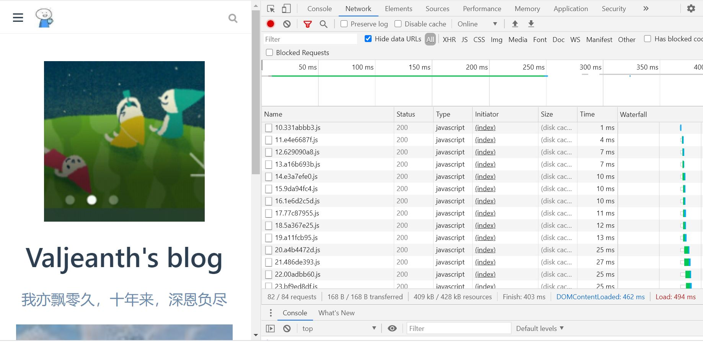

# 浏览器缓存机制

## 前言
这部分知识会涉及到 缓存服务器(代理服务器)，以及 http 首部的 catch-control 字段。    

我们借了解浏览器缓存机制，也顺便复习一下，之前的这些知识。    

## 缓存的作用

缓存的作用其实很容易理解。    

1. 一方面，如果本地有缓存，就可以用本地资源，而不必请求服务器了，页面加载速度肯定要快的多。      

2. 另一方面，由于没有请求服务器，也侧面的缓解了服务器的压力。    

当然，如果缓存多了，不清理的话，也可能导致浏览器卡顿。    

具体缓存流程如下图：    

     

---

下面我们来介绍浏览器的两种缓存解决办法。    

## 强制缓存

首先，我们明确一些前提，    

1. 第一次访问时肯定是没有缓存的，     

2. 第一次请求接受到了响应后，浏览器如何知道哪些资源该缓存，哪些又不需要呢？唯一的信息就在响应头部了。     

3. 事实上，也确实是在响应头部，告诉浏览器，我这次响应的资源是否缓存，缓存多久就失效了。     

4. 而这些信息一般由两个响应头部字段控制，Cache-Control，Expires。     

---

所以我们先来了解这两个字段。     

**Cache-Control**    
, 见名知意，就是控制缓存相关的。我们来看看它有哪些值。      

|值|解释|
|---|---|
|public| 所有内容都将被缓存(客户端和代理服务器都可缓存)|
|private| 所有内容只有客户端可以缓存，默认值|
|no-cache|客户端缓存内容，但是否使用缓存则需要经过协商缓存来验证决定(稍后会介绍)|
|no-store|所有内容都不会被缓存|
|max-age= x | x 秒后，缓存会失效|     

代理服务器基本和 cdn 原理一样，代理服务器保存源服务器的一些内容，请求命中时，直接返回响应。     

**expires**    

它是 http/1.0 实现缓存的方式，仅做了解即可，因为它与 cache-control 同时出现的时候，后者是优先考虑，存在的理由是考虑兼容。    
它的值，是缓存过期的时间，但由于各国时间不同，因此不准确。      

---

通过上的描述，我们知道了缓存如何告知浏览器，那么缓存资源存在哪呢?    

来看打开自己的博客，资源请求情况：    

      

size 的部分显示的是，请求资源的大小，我们刷新一遍再看。     

     

再看 size 部分，显示的是 diskcache,说明资源是从 diskcache 来的      

再刷新一次(得间隔很短时间很刷新哦，这个很重要，因为时间过长的话，看不到下面结果)     

    

再看红圈的 size 部分，显示的是 memorycache，说明资源文件是从 memorycache 来的。       

很明显，diskcache 就是硬盘上的缓存了，一般是存储在文件中的 ，memorycache，是内存上的缓存，进程执行完就删除。    

很 cpu 运行很像，浏览器优先考虑用 内存中的资源(因为读取块)，也就是 memorycache，没有才用外部(硬盘文件)     

但，memorycache 保存的时间很短(因为内存空间比较小，不可能放太多东西)，一段时间后，相关进程关闭，memorycache 也就自动删除了。    

这也解释了为什么第二次刷新为什么要间隔很短操作。    

### 缓存资源放在哪？

memorycache 里面的东西，我们不好查看，但是 diskcache 既然是文件形式，我们就能再磁盘中找到它。    

以 Google 浏览器为例子。     

这部分文件存储路径如下：    

**C:\Users\username(自己的用户名)\AppData\Local\Google\Chrome\User Data\Default\Cache**

我们打开后如下：    

    

很遗憾，我们无法打开这里的文件，也看不懂它是什么。    

这里就可以用一个工具 ChromCacheView    

打开后，它会自动打开上面目录的 cache 文件夹，然后给我们显示的结果如下：    

     

看到这里，应该就能明白存储的是什么了，是的，是 http 响应报文。      

这便是我们的 diskcache 里的内容。    

同样，我们也能类比出 ，memorycache 中存的也是 http 响应报文。    

---

似乎有些扯远了，我们还是回到强制缓存。     

强制缓存就是请求时先 查找浏览器的缓存结果，再根据该结果来确定是否用该缓存结果    

请求时一般会碰到这四种情况     

1. 第一次请求， 没有缓存。    

2. 虽然不是第一次请求，但是之前收到的响应报文没有叫我缓存，于是得继续向服务器发请求。    

3. 之前收到的报文由明确叫我缓存，浏览器缓存了，但是查到后发现，有效时间过了(max-age),于是该缓存就没啥用了，还得重新请求。    

4. 查到浏览器的缓存了，且还在有效期，于是就不请求了，直接返回之前缓存的结果。    

---

在看 第三条 的时候，是不是觉得很遗憾？，我明明缓存了呀，虽然有效期过了，但说不定你服务器中的资源没有改变呢？    

那我还是可以用这个缓存的资源，于是，浏览器就先不急着请求服务器的响应报文，先和浏览器协商一下，问一下，自己的缓存还能不能用。   

于是也引起了我们第二种缓存——协商缓存。      

## 协商缓存

接着上一节的结尾说，浏览器和服务器协商的方法有两种(肯定都是通过首部来协商)。     

### Last-Modified/If-Modified-Since

Last-Modified 是响应报文的一个字段，用户告诉该报文最后修改的时间。    

If-Modified-Since 是请求报文的一个字段，值是上一次响应报文的 Last-Modified。    

也就是说，浏览器把 If-Modifed-Since 字段发出去后，服务器就可以和服务器上该资源最后修改的时间进行对比    

如果时间是一样的(没有修改过)。    

就返回  304 Not Modified    

告诉浏览器，放心用那份缓存资源吧，还有用的，我就不重复发一份了，毕竟都一样。    

如果，最后修改的时间大于 If-Modified-Since 的话，说明真的失效了，得重新发一份。    

### Etag/If-None-Match

如果，在服务器响应的时候，给该资源一个独一无二的标签 Etag。    

并且服务器默认规定，只要资源不更新，该资源就始终对应这个 Etag，资源更新就重新生成一个独一无二的 Etag(和之前的不同)

那么，请求时，就可以设置 if-none-match 字段，并把值赋为 Etag。    

待服务器接收到请求报文后，就会根据这个 if-none-match 的值来匹配，看是否有资源的 Etag 是这个。      

如果有，说明资源未更新，返回 304 Not Modified.    

如果没有，说明资源更新了，在响应中返回新的资源，返回 200 OK       

## 清除缓存

如果想清除缓存的话，       

- f5 刷新网页会跳过强制缓存，但是会检查协商缓存。       

- ctrl+f5 刷新网页的话，直接从服务器加载资源，强制缓存和协商缓存都会跳过

## 总结

之前，学过，为什么 webpack 打包 js ，css 这些资源文件的时候是以一个唯一的 hash 码命名，且重新打包后，又会重新生成新的不一样的 hash 码文件名。     

放在这里来理解一下。当服务器的资源更新时，webpack 会重新打包，生成新的 hash 文件名(所有打包后的文件)    

带来的好处是，如果缓存的资源还在有效期，但在这期间服务器改动资源，浏览器是请求不到新的资源的。    

通过 webpack 的打包，就能实施实时更新。     

但是，坏处是，之前的强缓存就会全部失效，因为文件名都不同了(url 自然也不同了)，浏览器以为在请求不同资源呢。    

带来的是，协商缓存也跟着失效，因为浏览器以为自己没有要请求资源的缓存，自然不会去关注过期。更不会去协商。        

如果我觉得要改进的话，最好，是 webpack 打包时只重新为那些更改了文件重新生成 hash 值。     

如果能做到这点的话，就没有必要设置过期时间了，因为一更新文件名就会改变，就会立马知道。于是协商缓存就没有必要存在了。

参考：https://juejin.cn/post/6844903593275817998
http://cn.tipsandtricks.tech/%E5%A6%82%E4%BD%95%E4%BB%8E%E6%B5%8F%E8%A7%88%E5%99%A8%E6%9F%A5%E7%9C%8B%E7%BC%93%E5%AD%98%E7%9A%84%E9%A1%B5%E9%9D%A2%E5%92%8C%E6%96%87%E4%BB%B6

