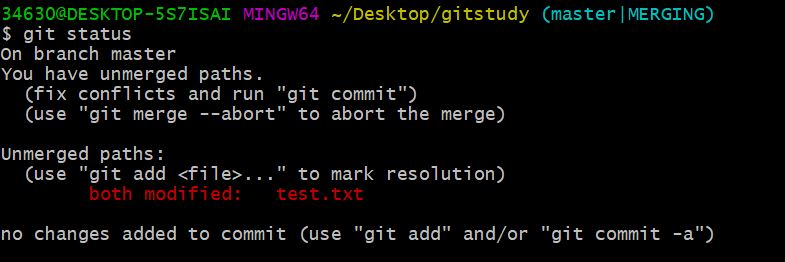
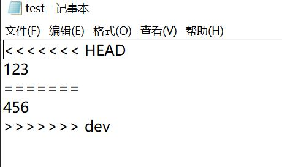

# git学习 合并冲突     

## 前言

很多情况下，我们合并的分支，可能对同一个东西进行了改动       

这时候，就不能随便合并了， git 会暂停合并的工作，因为，git 不知道你想要谁的改动。          

之前 push 不上，用 git stash 也是一样的道理。       

mater 分支，不知道我们改动了哪些。       

所以，我们先 git stash 暂存本地文件，       

接着，git pull 拉下最新代码。      

git stash pop， 合并，此时 stash 就类似一个分支。      

当你有相同的改动内容的时候，代码会出现提示，     

 <<<<<<< , ======= , 和 >>>>>>>        
 
我们只需选择想要的版本， 把这些冲突解决完成之后就可以 push 了。     

## merge 冲突的解决

直接看吧。     

我咋 master 分支中，把 test.txt 写上 123       

在 dev 分支中，把 test.txt 中的 123 ，改成了 456      

- git merge dev     

      

信息告诉我们，text.txt 合并时出现冲突，让我们解决冲突后再合并。      

查看一下状态     

- git status       

       

也是告诉我们 text.txt 有冲突，去解决吧。      

我们打开 test.txt      

      

可以看到， git 让我们在 两个版本中选一个。     

选你想要的版本后(我这里留下了 456 )       

- git add .      (ps ：只需暂存 git 就知道冲突已经解决)    

- git merge dev      

就 ok 了。      

ps: 上面 git 给的提示中，有一个 head， 一个 dev， 这个放到后面讲