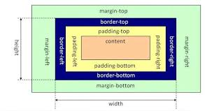

# 盒子垂直居中的方法
 
**这里只浅谈我比较熟悉的，也用过的几种，因为随便搜一下，方案实在太多了**

## 绝对定位 +  transform 

首先，让盒子绝对定位，脱离文档流，    

接着，让他距离左边，上边都是 body 的 50%。   

到此，真正居中的是，盒子的左上角的点，所以让盒子偏移自身大小的 50% ，即可实现居中了

代码如下：
```html
<style>
    body {
        width:100vw;
        height:100vh;
    }
    .box {
        width: 200px;
        height:200px;
        background-color: red;
        position: absolute;
        top: 50%;
        left: 50%;
        transform: translate(-50%,-50%);
        }
</style>
<body>
<div class='box'></div>
</body>
```

## 使用 flex

这是我最喜欢用的布局了，弹性布局，非常适合移动端    

* 首先，声明了 body 为 flex 布局
* 接着，justify-content: center;  声明了 body 里面的子元素 水平上是居中
* 然后，align-items: center; 声明了 body 里面的子元素 垂直上是居中的

于是，盒子就处于水平垂直居中状态了。

代码如下：
```html
<style>
    body {
        display: flex;
        justify-content: center;
        align-items: center;
        width:100vw;
        height:100vh;
    }
    .box {
        width: 200px;
        height:200px;
        background-color: red;
        }
</style>
<body>
<div class='box'></div>
</body>
```

## 使用 margin: auto

这里需要深挖一下，margin 这个属性，以及盒模型    

盒模型图片如下：    
    

在水平方向来说 

涉及到横向格式化属性。     

那么横向格式化属性是个什么东西？    

他包含七个属性：margin-left、border-left-width、padding-left、width、padding-rigth、border-right-width、
margin-right，这七个属性影响着块级框的横向布局。  

他们七个的值加起来要等于元素容纳块的宽度，而这个宽度通常就是块级父元素的width值。

垂直方向也是同理。    

我们再来看下面代码，    

* 首先，给盒子绝对定位，
* 然后，让它的 top，left，right，bottom，都为 0 ；
* 最后，加一个 margin: auto 属性，因为，第二步让它的距离四周都为 0 ，    
    但是上述的 7 个属性是加起来要等于父元素宽度或者高度的，于是，margin 让它自适应就发挥作用了
    它将使 margin-top，margin-bottom 均分上下多余的空间，margin-left,margin-right,均分左右空白

代码如下：
```html
<style>
    body {
        width:100vw;
        height:100vh;
    }
    .box {
        width: 200px;
        height: 200px;
        background-color: red;
        position: absolute;
        top: 0;
        left: 0;
        right: 0;
        bottom: 0;
        margin: auto;
        }
</style>
<body>
<div class='box'></div>
</body>
```

### 使用 绝对定位 + margin 负值

了解了上面的的原理，我们就可以换一种思路来实现 水平垂直居中了。

当我们知道盒子的宽度和高度时，可以这样做    

* 让盒子绝对定位
* top:50%,  left:50% 
* 最后，margin-top: -(box.height/2),  margin-left: -(box.width)/2

代码如下：

```html
<style>
    body {
        /* display: flex;
        justify-content: center;
        align-items: center; */
        width:100vw;
        height:100vh;
    }
    .box {
        width: 200px;
        height: 200px;
        background-color: red;
        position: absolute;
        top: 50%;
        left: 50%;
        margin-top: -100px;
        margin-left: -100px
        }
</style>
<body>
<div class='box'></div>
</body>
```

## 总结

**居中图片如下**    

    

其实，一方面得熟悉盒模型，另一方面学会一些布局框架。就能掌握一些居中方法，并活学活用    

参考： https://www.jianshu.com/p/82f02af17e78


