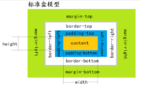

# 盒子模型

盒子模型有两种，    

一种是 IE 盒模型，一种是 标准盒模型     

我们这里来分别进行讨论。    

## 标准盒模型

 标准盒模型是这样定义一个盒子的。如下图：    

     

 我们注意的一点是，盒子的 width 属性仅是内容得宽度，也就是说，padding 和 border 是不算在内的。    

 这里就很容易造成疑惑，并且还带来一些问题。    

 比如，你一开始给盒子大小是 300*200 的，但是，当你设置 padding 和 border 之后，盒子就会越界了。    

 我们就不得不重新改变 width 的值。     

 于是我们有了一种更好的盒模型：IE 盒模型。    

 ## IE 盒模型

 要让盒子变成 IE盒模型，只需声明 box-sizing: border-box.    

 指明了这个属性后，该盒子就变成了 IE 盒模型了，但是这个属性的默认值是 box-sizing: content-box (默认标准盒模型)     

 所以，很多项目会最开始就声明盒子都为 IE 和盒模型，以方便操作。     

 说了这么多，我们再来看 IE 盒模型的样子。    

     

 IE 盒模型是盒子宽度 width = boder-left + padding-left + contentwidth + padding-right + border-right.     

 IE 模型就很合理，因为一个盒子，的宽度，你肯定时按照外面的盒子宽度来算吧，总不能盒子放什么，你盒子的宽度就是什么。    

 

