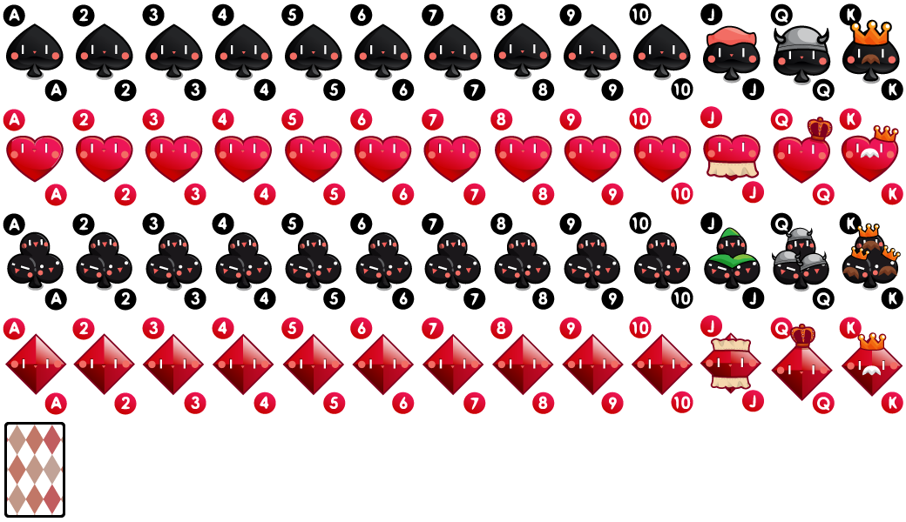

# 精灵图进阶

这里主要是复习一下精灵图的使用，更主要是学习如何优雅的写 css        

情景：要从一个图形切取多个精灵图连续使用。          

图片如下：     

         

我们想连续展示几张扑克。代码如下：     

```html
<style>
 .box {
   display: flex;
 }
 .box>div{
   background-image: url('./assets/card.png');
   width: 80px;
   height: 120px;
   margin-right: 20px;
   border: 2px solid #0f0;
   border-radius: 5px;
 }
 .box :nth-child(1){
   background-position: -80px -120px;
 }
 .box :nth-child(2){
   background-position: -160px -120px;
 }
 .box :nth-child(3){
   background-position: -240px -120px;
 }
</style>
<body>
   <div class='box'>
     <div></div>
     <div></div>
     <div></div>
   </div>
</body>
```     

效果如下：    

        

总结一下就是，这里用到了伪类，使得我们的 html 骨架很简单，且 css 也能用尽量少的代码给到样式。        

如果是 vue 或者 react 可以用循环的话，div 只要一行就解决了。        

所以在这种时候，要巧妙的使用伪类来定位元素          


