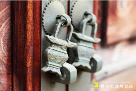

# 锁     

    

从前慢，车马邮件都慢，    

&nbsp; &nbsp;&nbsp;&nbsp;&nbsp;&nbsp;最近，骑自行车，妈妈总叫我记得锁车。我总是不以为然，觉得，要是碰到偷车贼，他总有办法把你的锁撬掉，要是碰到普通人，谁会管你车上不上锁呢。所以没有锁的必要。    

&nbsp; &nbsp;&nbsp;&nbsp;&nbsp;&nbsp;今天，无意间，看到一个一个话题。说女生出门穿着暴露被坏人猥亵，女生有没有责任。这里并
不想为坏人开脱。前几年爱尔兰女性们举着内衣游行，以抗援助那名 17 岁被侵犯女生的。看到这个新闻的时候，我想到了萧伯纳的一句话，*聪明人适应环境，愚蠢的人改变环境，但历史总是后者创造的* 。我很钦佩这些游行的，想改变环境的人。女生爱穿什么样的服装出门，那是女生的自由，更是女生的权利。但这里想借用一下华生的行为主义思想，客观的说，女生出门穿的过于性感这个诱因，的确会提高她被猥亵的概率的。所以，责任当然是坏人的责任，但若想远离被骚扰，在当前这个环境下，裙子长是有作用的。    

&nbsp; &nbsp;&nbsp;&nbsp;&nbsp;&nbsp;再回看自己自行车的锁，其实，渐渐发现了它的作用。的确，它难以防备真真的偷车贼。但少，
它锁了，就是在告诉你，君子勿碰。中学的时候，每周的值日，轮到我打扫停车场，我总喜欢和一起打扫的小伙伴，骑那些没上锁的自行车练漂移玩。若记得原来的位置，骑玩之后就放回原位，若不记得了也就随便一停，就走了。直到班级上有个好朋友车子找不到了，我陪他找了好久的车。在此之后，我再没有乱骑别人的车玩。其实，锁，更多时候是锁的不仅仅是物体。    

&nbsp; &nbsp;&nbsp;&nbsp;&nbsp;&nbsp;无论是《三字经》里说的人性本善也好，还是佛洛伊德所说的人性本恶也好。有一点可以比较受
的是，每个人，或多或少，内心总会有些阴暗面的。有心里学家做过实验，把辆辆相同的车停在路边较长的时间，且其中一辆车的车窗弄碎。等到一个月后，过来看两辆车情况时。未破损的车还是完好无损，但碎了一扇窗的那辆已经破浪不堪了。不难推断出，有人看到车的车窗坏的，就以为可能是别人不要的车，于是砸碎其他窗户来缓生活的焦虑，或者只是为了娱乐。随着破坏的越严重，越多的人认为是废弃的车，越多的人，把它当做解气的工具。我们能说这些人都是坏人吗？当然不合适，他们是普通的人，只不过内心的黑暗被放大罢了。    

&nbsp; &nbsp;&nbsp;&nbsp;&nbsp;&nbsp;国富论里说，市场有一双无形的手，可以让让大家都仅仅追求自己利益的时，所造成的结果是整
个社会受益。其实生活中也有一双无形的手，看似大家都没做什么罪大恶极的事，但是，当很多人这样想，结果往往是大家共同造成了令人心痛的结果。等到追究责任的时候，这些人就会说，我不知道会这样啊？我以为是小事呢。所以锁的作用何在？锁是用来锁住这只手的。很多的时候，你锁了，人家就懂了。    