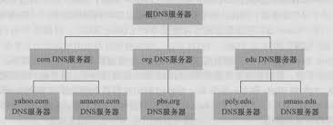
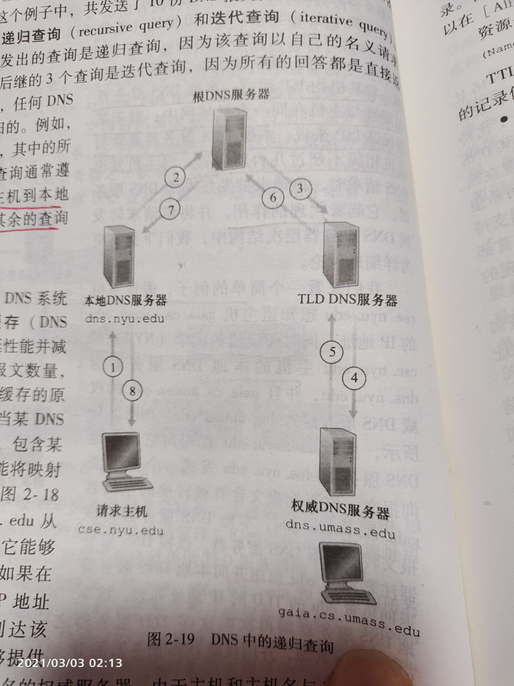

# DNS 的原理

## 前言

DNS 主要功能就是 提供 主机名 转 IP 服务的。    

他是一个协议，在应用层，运行在 UDP 之上，使用 53 号端口。    

它也是一个由分层 DNS 服务器实现的分布式数据库。    

---

了解了 DNS 是什么，我么再来看它的工作原理。    

## DNS 工作原理

先来看一个最简单的例子。    

当我们在浏览器中输入一个 url 之后会发生什么呢？    

- 同一台用户主机上运行着 DNS 应用的客户端。    

- 浏览器将上述 url 中抽取出 主机名，并将主机名，传给 DNS 应用客户端。    

- DNS 客户端向 DNS 服务器发送一个包含主机名的请求。    

- DNS 服务器返回一个包含 IP 地址的报文给 DNS 客户端，并转交给浏览器。    

- 流浪器拿到 ip 后，立即向该 ip 地址的 80 端口的 HTTP 服务器发起 TCP 连接。    

    

---

对用户来说，DNS 就像一个黑盒子，主机名进去，ip 出来。接下来我们来打开这个黑盒子，看看它到底干了什么。    

### DNS 服务器类型

DNS 应用程序在我们客户端，主要就是把浏览器转交的 主机名 发送出去，得到 ip 再转交给 浏览器。这里不多谈。    

我们更关注的是 DNS 的服务器。     

下面是 DNS 服务器的种类。    

1. 根 DNS 服务器：    
    - 有 400 多个 根 DNS 服务器遍及全世界，它们由十三个不同组织管理。    

    - 根 DNS 服务器 主要提供 TLD(顶级域名)服务器的地址。    

2. TLD(top-level domain) DNS 服务器：    

    - 对于每一个顶级域(如 .com  .org   .edu) 和所有国家的顶级域(如：.ca  .jp  .fr) 都有 TLD 服务器.    

    - TLD 服务器提供了权威服务器的 ip 地址。    

3. 权威 DNS 服务器：    

    - 在因特网上具有公共可访问主机(如 web 服务器)的每个组织必须提供公共可访问的 DNS 记录。这些记录将 主机名 映射成 ip 地址。而，一些组织的权威服务器收藏了这些 DNS 记录。    

    - 当然也可以支付费用，把这些记录存在服务器提供商的 权威服务器中     

4. 本地 DNS 服务：    

    - 主机的本地 DNS 服务器通常邻近本主机。    

    - 对某机构 ISP 而言，本地 DNS 服务器可能就和主机在一个局域网中。    

    - 对某居民区而言，本地 DNS 服务器通常与主机相隔不超过几台服务器。    

---

严格来说，本地 DNS 服务器并不属于 DNS 服务器的层次结构，其层次结构如下：    

    

### DNS 工作流程

先来看图，我们按照图片来分析    

      

1. 假设主机想知道 www.163.com 的 ip    

2. 首先向本地 DNS 服务器发送报文。    

3. 本地DNS服务器转发到根服务器，根服务器返回对应顶级域服务器 ip 地址，这里是 .com    

4. 于是，本地DNS服务器拿到这个 ip 后，就向 .com DNS服务器发送报文。顶级域服务器返回对应的权威服务器的 ip    

5. 本地服务器又拿到该 ip 去请求 权威DNS服务器 163.com，它里面存在对应的 ip 地址，将其返回。    

6. 于是本地 DNS 服务拿到想要的 ip 就转发给 DNS 客户端，再转给浏览器。    

--- 
我们顺便来了解一下两种查询方式，迭代查询，递归查询     

**递归查询**    
图中 step1 和 step2 是递归查询    
递归查询很像深度遍历。    

**迭代查询**    
图中 step2 step4 step6 是迭代查询   
迭代查询很像广度遍历。    

当然也可以全部都用递归查询，如下图：    

    

不过，通常查询不会采取这种模式，一般是我们分析的那种查询方式。     
即，请求主机到本地DNS 是递归的，其余都是迭代的。    

### DNS 缓存

实际上，不可能所有的 DNS 查询都要走这么多弯，因为我们没个服务器都是有缓存的。    

当第一次访问后，就会有缓存。比如我们访问过一次 www.163.com 后，本地服务器下次就可以直接在自己缓存中找到其对应 ip 了，不用费更多功夫。    

通常，DNS 服务器缓存时间是 2 天，两天过后自动抛弃。    

而且，有了缓存的存在，几乎没有查询会经过 根DNS服务器 了。    

## DNS 报文与记录

DNS 中的记录中储存了 资源记录到 ip 的映射，且每个回答报文中都会包含一条或多条记录。     

### DNS 记录

DNS 记录是包含下列字段的四元组。    

**(name, value, type, ttl)**    

- TTL 是该记录的生存时间，规定多少时间后，自动删除该条记录。    

- name 和 type 值取决于 type    

- 我们重点来看 type。     
    1. Type = A, address，表明 name 是主机名，value 是主机对应的 ip       

    2. Type = CNAME, canonical name, 表明 value 是别名为 name 的主机对应的规范主机名，也就是说，访问 name 其实就是访问 value，那你就反问 value 去吧。例子可以看 cdn 原理。如：    
    (foo.com, relay1.bar.foo.com, CNAME,145.37.45.34)    

    3. Type = NS, 则 name 是个域，而 value 是如何获得该域中主机 ip 地址 的权威DNS服务器的主机名，这个记录用于查询链来路由DNS查询。    

    4. Type = MX, 表明 value 是别名为 name 的邮件服务器规范主机名，这里仅做了解。     

### 报文

报文暂时搁置在这，因为没碰到过，给幅图，仅做了解。    

