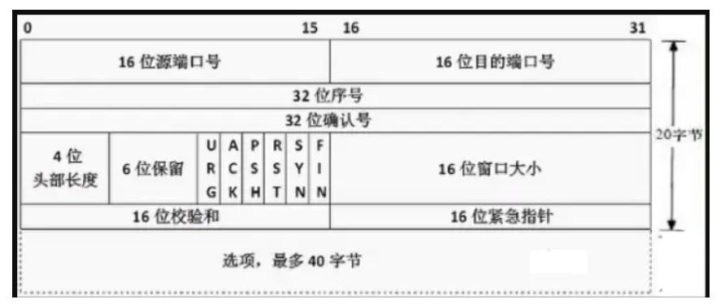

# TCP 的报文

## 前言

这里详细介绍一下 tcp 的报文结构。      

主要是了解 tcp 首部各个字段的作用。          

首先， 一个 TCP 包的大小受到 最大报文段限制(MSS)         

MSS 通常根据最初确定的由本地发送主机发送的 最大链路层帧长度 即最大传输单元(MTU) 来设置       

通俗来说，就是一个 tcp 包不会被下层协议给切成两份传递。       

也就是说 tcp首部 + 数据 <= MSS      

其报文结构如下：     

       

## TCP 首部

首部一般 20 个字节。       

### 源端口号和目的端口号

这个两个分部占 2 个字节。       

源端口号是发生方发生的端口号， 目的端口号是接受方的端口号。        

它们是用来多路复用和多路分解的。 这里顺便提一下这两个概念        

1. 多路分解： 将运输层报文段中的数据交付到正确的套接字的工作，端口号就是各个套接字的标识。可惜想象一下，运输层发来很多数据，但你的不同应用要拿的数据包是不同的，比如 qq， 浏览器。这时候，就得把这些数据包根据各自的目的端口号进行分解。然后交给上层协议，或者说给对应的应用软件。       

2. 多路复用： 多路复用就是和上面反这来的，所有的应用都得走传输层这一条路。那么就得有一个标识，表示你是哪来的。这个标识就是源端口号。        

### 序列号和确认号

序列号站了 4 个字节。 确认号占 4 个字节       

它们在 tcp 简介中说过了，主要是应答的时候保证数据的可靠传输。        

### 接收窗口

接收窗口在 tcp 的流控制里也说过了。     

主要是接受方告诉发送方，自己缓冲区有多少空位，你下一次发送的窗口大小应该是多少。        

### 标志字段

标志字段有 6 比特， 分别是 6 个标志       

1. ACK : 用于指示确认字段的值是有效的，即该报文段包括一个对已被成功接受报文段的确认。规定连接后 ACK = 1          

2. SYN : 用于建立请求连接         

3. RST : 用于重新建立连接，即连接重置。     

4. FIN : 用于请求断开连接        

5. PSH : 该位置为 1 时，告诉接受方应立即将数据交给上层。不要等缓存慢了再加交付     

6. URG : 该位置为 1 时，表明报文中存在着被发送方上层实体设置为 紧急 的数据，该数据的最后一个字节由 2 字节的紧急数据指针指出。        

### 校检和 和 紧急数据指针

它们都是占 2 个字节。      

校检和主要是防止传输中数据出错，采用编码的方式对其进行校检。       

紧急数据指针指向报文中的紧急数据末尾字节。表明该数据应当立即交付。        

### 首部长度 和 保留未用

首部长度占了 4 字节，由于 TCP 选项字段额原因， TCP 首部的长度是可变的。      

通常选项字段是为空的，所以一般 TCP 首部是 20 个字节。          

## 选项

该部分主要用于      

1. 发送方和接收方协商最大报文段 MSS 。       

2. 网络拥塞时，用作窗口的调节因子        

## 数据

里面放的是 应用层传来的 数据包
