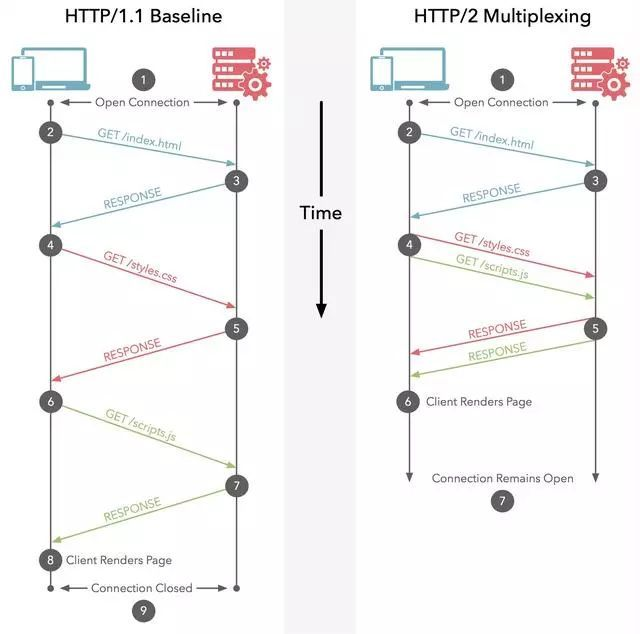

# htpp 1.0/1.1/2.0/3.0
## 前言

## http 2.0
这里先主要讲一下 http 2.0    

提到 2.0  当然就得先提到 1.1 有哪些问题，然后 2.0 是如何解决这些问题的。     

1. 一个 tcp 连接上，一次只能发送一个请求，如果有多个请求，就会排队等待。     

2. 头部冗余，采用文本格式传输。    

3. 客户端需要主动发送请求。    

再来看 http2.0 是如何解决这些问题的。     

### 多路复用

名如其意， 多路复用就是考虑，让一个 tcp 连接能同时发送多个请求，当然和进程一下，这里是并行，不是并发。     

如下图：     

    

想要实现该如何做到呢？     

我们先来想象一下，多个请求并发的情况是如何。     

建立一个 tcp 连接后，客户端发一个请求，只有等到服务器返回响应了，才能发送下一个请求。     

但 http2 不一样，它可以在第一个请求还没收到响应就继续发另请求，     

带来的好处是，各个请求到接受反应的时间大大缩小。     

但也带来一个问题，就是比如第一个请求稍有些延迟，后一个请求先到了，并且后一个响应也先到浏览器这边。     

那么我怎么才能知道，哪个请求对应的响应是哪个呢？      

这时候就需要对发的数据进行编号，这也正是我们的 http2 所干的事情。     

---    

我们这里还要说到一个概念  **二进制分帧层**     

二进制分帧层介于应用层和传输层之间     

它会把 http2 传输的信息分隔为帧(frame)，并对他们采取二进制格式的编码，其中首部信息会被封装到 headers frame 中， request body 的数据则封装到 data frame 中，如下图所示        

      

到这里我们了解了。    

http2 主要是把 http报文 分为更小的数据块(帧)，并标记，编码成二进制。从而达到并行发送的效果，接收方，只需按照标记的规则把数据重组为 http 报文就 ok 了      

---

再接着了解一下几个概念，方便我们对后面的过程有更清楚的了解。     

1. 数据流： 已经建立连接内的双向字节流(一条发送，一条接收)，可以承载一条或者多条消息     

2. 消息(message): 与逻辑请求或响应消息对应的完整的一系列帧，这里可以简单理解为一份 http 报文。     

3. 帧： http/2 的最小通信单位，没个镇包含帧头，至少也会标识出当前帧所属的数据流。    

将上述概念总结一下，就是      

- 所有通信都在一个 tcp 连接上完成，此连接可以承载任意数量的双向数据流。     

- 每个数据流都有一个唯一的标识符和可选的优先级信息，用于承载双向消息。      

- 每条消息都是一条逻辑 http 消息(例如请求或者响应)，包含一个或者多个帧     

- 帧是最小的通信单位，承载着特定类型的数据，如 http 标头，消息负载等等，来自不同数据流的帧可以交错发送，然后再根据每个帧头的数据流标识重新组装     

下面是一个传输过程的快照，方便来理解。     

总而言之，通过二进制分帧层，我们使得多路复用这个方法得以实现，从而大大提升传输效率。    

### 头部压缩
每个 HTTP 传输都承载一组标头，这些标头说明了传输的资源及其属性。 在 HTTP/1.x 中，此元数据始终以纯文本形式，通常会给每个传输增加 500–800 字节的开销。如果使用 HTTP Cookie，增加的开销有时会达到上千字节。 为了减少此开销和提升性能，HTTP/2 使用 HPACK 压缩格式压缩请求和响应标头元数据，     

具体做法是维护表，将常见字段和值都放到表里。      

我们就可以把 头部用表中各个字段的索引代替，传到另一端的时候，只需查表，就可以恢复头部了。     

这样就把一个字段变成了一个字节的数字，从而大大压缩了头部的字段。     

表有两张，一张是静态的，即我们常用的，可以通官方网站查到      

      

还有一张表是动态的，是可以随意添加的，比如之前传过来的头部有的字段和值不在表中，     

我们就可以将其加入表中，下次若还传一样的，只需传索引即可。     

若表中有的字段只给了名称，没有值 如 cookie ，便第一次可以用哈夫曼编码把这些值压缩再传递。     

### 服务器推送

服务器推送也和字面理解差不多，即客户端没有发送请求，服务器也把数据发送过去。     

当然服务器不是乱发的。举个例子     

当客户端请求  html 页面时，服务器发现这个 html 文件还依赖一些其他的 css 文件，以及 js 文件，     

服务器就会通过服务器推送，把这些数据推送给客户端，(毕竟客户端肯定是要用的，既然请求了该 html 文件的话)     

总而言之，就是一份请求，发送多个响应。     

看图吧：     

      

## http3.0

### http2.0 的问题

在谈 http3.0 之前，我们还是先来看看 2.0 到底存在哪些问题，以致 3.0 的出现        

1. 建立连接时间长(tcp 三次握手)     

2. 队头阻塞的问题       

3. 弱网环境下，表现不佳       

很明显，以上的缺陷基本都是它的底层协议 TCP 造成的，所以，http3.0 选用了 udp      

但是我们知道，udp 是无连接且不可靠的，所以自然不能直接用 udp       

于是 google 在其基础上改造出了一个新的协议 QUIC        

### QUIC

QUIC 读作 quick 是 Quick UDP Internet Connections 的缩写，直译为 快速UDP互联网连接。       

而 HTTP3.0 又称为 HTTP Over QUIC       

先来看 http2 和 http3 的对比      

         

---      

ok， 下面来详细讲一下 QUICK      

1. 解决队头阻塞问题。       

队头阻塞问题是这样的，当一数据包没有到达时，后面的数据也无法传达，http1 时，由于连接是单条的，也就是说，一个请求卡住了，可能导致后面的请求都拿不到数据。      

而 http2.0 通过多路复用解决了应用层上这个问题，       

但是，在传输层上，tcp 这个问题还是没有解决。      

因为 tcp 通过窗口传送时，若最前面的数据丢了，那么后面到达的数据始终会停留在缓冲区里，不会交给上层协议。       

但是，由于 QUICK 是基于 udp 的，一个连接可以有多个流，流与流之间是相互独立的，当一个流丢包时，影响的范围非常小。从而解决队头阻塞问题。        

2. 0RTT 连接       

RTT 是数据包一来一回的时间。       

https 建立连接要 3次tcp 握手，5次 ssl 握手，要费很多时间。      

但是， QUIC 协议可以实现第一个包就包含有效数据。       

当然这是有条件的，第一次连接是要互相验证身份的。       

- 首次连接        

    首次连接是要验明身份的，因为要保证传输的可靠。       

    而验证的方法类似于 ssl 加密，这里稍微提一下。     

    1. 客户端首先发送一个 client hello 请求。      

    2. 服务端收到后，生成一个素数 p， 一个整数 q，一个随机数 Kspri 作为私钥，用 p，q，Kspri 计算出公钥，Kspub,然后把, p, q, Kspub 打包成 config 发送给客户端        

    3. 客户端拿到 config 后，随机生成自己的私钥 Kcpri, 同样用 p,q 生成自己的公钥 Kcpub。再用自己的私钥Kcpri 和 收到的 公钥Kspub，生成数据加密的秘钥 K 。最后，用这个秘钥 K 加密数据，并把自己的 公钥Kcpub 传给服务器         

    4. 服务器此时已经拿到加密的数据了，还有客户端的公钥，它也用对方的公钥 Kcpub 和自己的私钥 Kspri 生成加密的的秘钥 K ,来解开加密的密文。       

    5. 为了更加安全，服务器还会生成新生成的公钥和私钥，由于之前拿到了客户端的公钥 Kcpub， 因此可以用这个公钥和自己新的私钥生成新的秘钥 M, 再用 K 加密 M 把 M 和 新公钥传给客户端        

    6. 客户端用 K 解密后，拿到新的服务器公钥，和加密过后的 M ，于是用自己的私钥和新的服务器器公钥解出 M ,之后传输都用该秘钥M      

 
- 非首次连接     

之前连接传输的 config 包，客户端可以存储下来，后续连接时可以直接使用，从而跳过连接，实现 0RRT      

当然，config 保存是有时间限制的，失效之后，仍要进行首次连接的交换。     

3. 连接迁移       

由于用了 udp 连接，只需一个 64 位随机数作为连接 id，在 wifi 和 4g 切换的情况下，不需要重新建立连接。   

