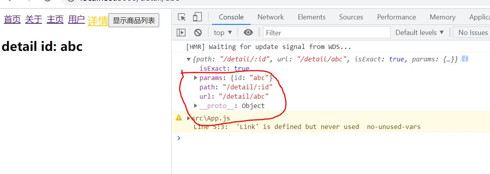

# React Router Dynamic routing

## Introduction

Sometimes, we want to pass parameter to child component using react-router.          

In this case, Dynamic Routing is a better choice .          

## Usage 

our App component like this:        

```js
import React, { PureComponent } from 'react'
import {
  BrowserRouter, // using history mode
  NavLink,
  Route
} from 'react-router-dom'

import Detail from './pages/detail'

export default class App extends PureComponent {
    const id = '123';
    render() {
        return (
            <div>
                <BrowserRouter>
                    <NavLink to={`/detail/${id}`}>详情</NavLink>
                    <Route path="/detail/:id" component={Detail}/>
                </BrowserRouter>
            </div>
        )
    }
}
```    

- First we import relative router API, in this component, I choose the **BrowserRouter** which means using history mode          

- Then, we connect the property **to** of **NavLink** to our parameter *id*          

- Finally, the Route's path we set **path="/detail/:id"**, pay attention to the **:**           

---        

Below is our Detail component:         

```js
import React, { PureComponent } from 'react'

export default class Detail extends PureComponent {
    render() {
        const match = this.props.match;
        return (
            <div>
                <h2>detail id: { match.params.id}</h2>
            </div>
        )
    }
}
```       
- in order to get the parameter passed by App ,we need to get the property **match**       

- we can log it to see what it is.       

         

as the picture showed, we can get **match.params.id**  to get the parameter.      

That's all.    
 
