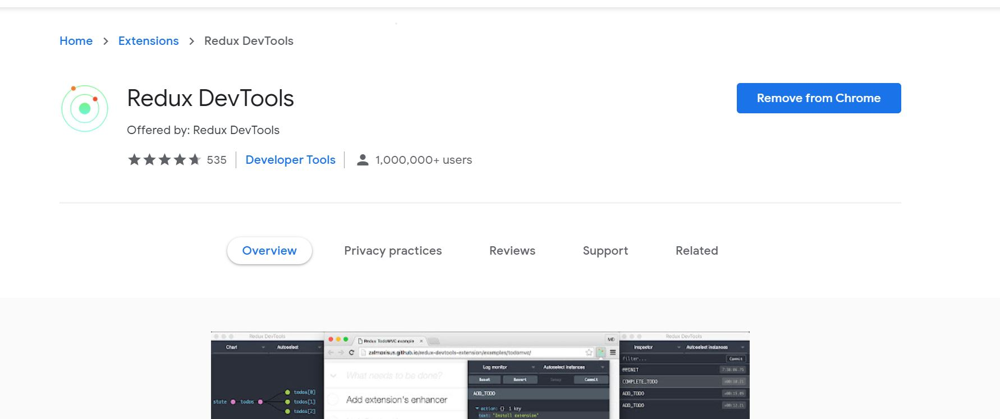
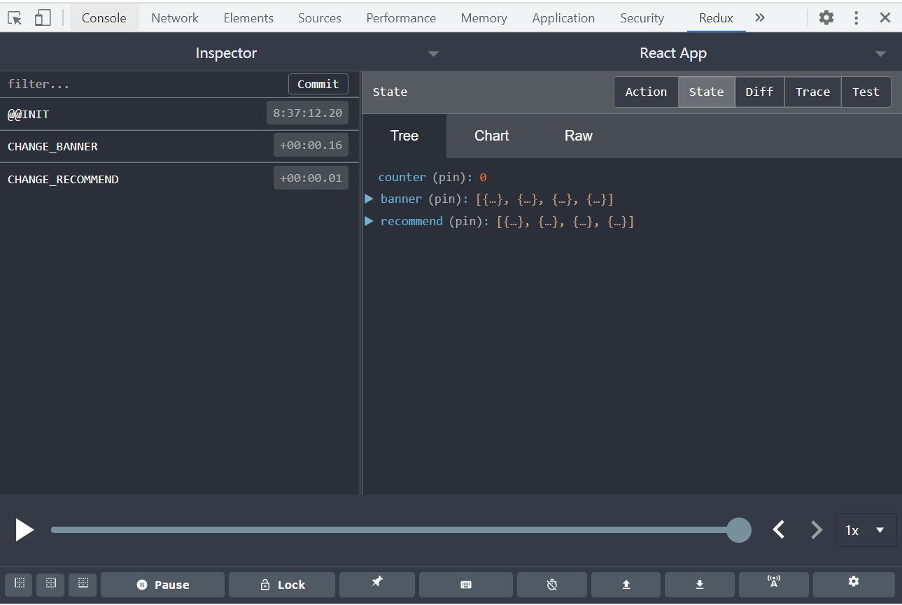

# redux-devtools

## Introduction

according to the introduction of redux-devtools on github           

it is a developer tools to power-up Redux development workflow or any other architecture which handles the state change           

That means it better our development with redux by making us able to see the state of store anytime we want.          

And, it can be used as a browser extension (for Chrome, Edge, Firefox), as a standalone app          

## Usage

1. first, we should open the chrome web store to search for it like this:     

          

just add to Chrome will be ok.          

2. next, in our codes, we need to do some thing.         

as usaul, we need open the file 'index.js' in folder store.          

what we need to do is showed below:        

```js
import * as redux from 'redux';

import reducer from './reducer.js';      


const store = redux.createStore(reducer,window.__REDUX_DEVTOOLS_EXTENSION__ && window.__REDUX_DEVTOOLS_EXTENSION__());

export default store;
```       

Let's talk some details.         

what we has done is just giving the function **redux.createStore** an argument to enhance this function         

---        

Yet, in most case, we need use the second argument to apply some middleware.         

and the codes will be like this:         

```js

import * as redux from 'redux';

import reducer from './reducer.js';      

import thunkMiddleware from 'redux-thunk'

const composeEnhancers = window.__REDUX_DEVTOOLS_EXTENSION_COMPOSE__|| redux.compose;
     
const storeenhancer = redux.applyMiddleware(thunkMiddleware)

const store = redux.createStore(reducer,composeEnhancers(storeenhancer));

export default store;
```

thunk-thunk is a middleware, we use **redux.applyMiddleware** to apply it,and get a **storeenhancer** as a result       

Next, we declare a function composeEnhnacer to enhance **storeenhancer** by wrapping it.          

actualy, **window.__REDUX_DEVTOOLS_EXTENSION_COMPOSE__** is alse a function ,we can config something like.          

```js
// that means we can trace state once changed
const composeEnhancers = window.__REDUX_DEVTOOLS_EXTENSION_COMPOSE__({trace: true})|| redux.compose;
```          

----       

After the configuation above.          

We start our project, and in Chrome extensive tools we can see it:         

        


