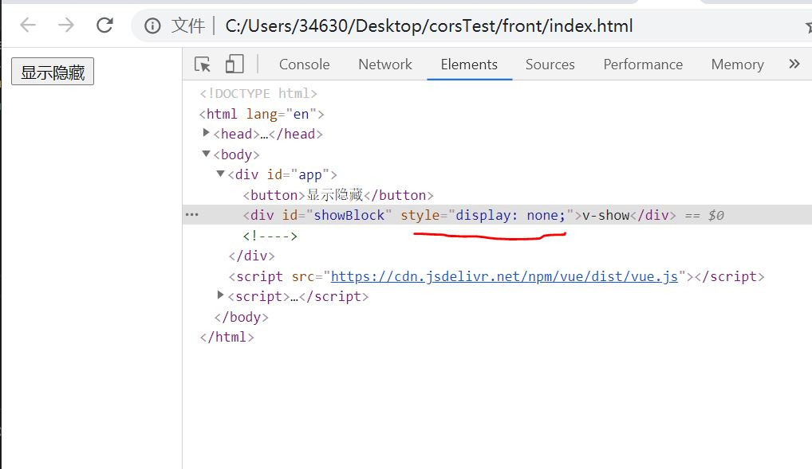
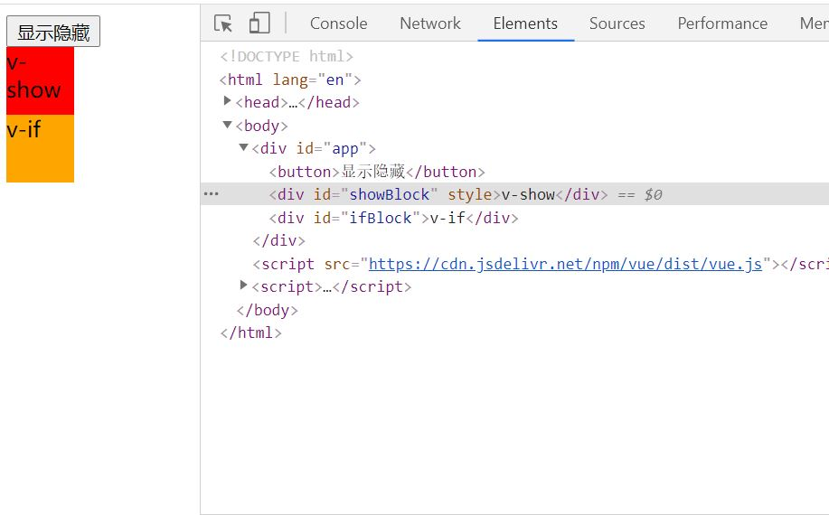

# v-show 与 v-if 区别    

## 实现的原理

- v-show : 本质是通过，display：none 和 display：block 来隐藏和显示    

- v-if ：本质是通过 DOM 节点的插入与删除来实现切换    

## 应用场景

- v-if:     
    1. 切换时需要插入删除节点，操作 dom 开销大    
    2. 初次渲染时，如果是 false 可以不渲染节点，节约性能
    3. 所以，在不需要频繁切换时用 v-if, 比如，用户和管理员所看的内容，初次渲染就已经确定了，不需要切换    
    此时，用 v-if 就比较好

- v-show:    
    1. 切换时通过 css 来实现，不需要操作 dom
    2. 初次必定会渲染    
    3. 所以适用于频繁切换的场景

## 实例

```html
<style>
    #showBlock {
        width: 50px;
        height: 50px;
        background-color: red;
    }
    #ifBlock {
        width: 50px;
        height: 50px;
        background-color: orange;
    }
</style>
<body>
    <div id="app">
        <button @click = 'showChange'>显示隐藏</button>
        <div v-show = 'isShow' id = 'showBlock'>v-show</div>
        <div v-if = 'isShow' id = 'ifBlock'>v-if</div>
    </div>
</body>
<script src="https://cdn.jsdelivr.net/npm/vue/dist/vue.js"></script>
<script>
    let app = new Vue({
        el: '#app',
        data: {
            isShow: false
        },
        methods: {
            showChange() {
                this.isShow = !this.isShow;
            }
        }
    })
</script>
```
运行结果如下图：    

    

隐藏时，如图，v-if 的 div 不存在，而 v-show 的 div 是 display：none    

    

显示时，v-if 和 v-show 的 div 都在
        